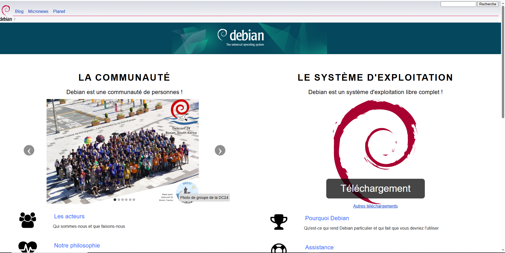
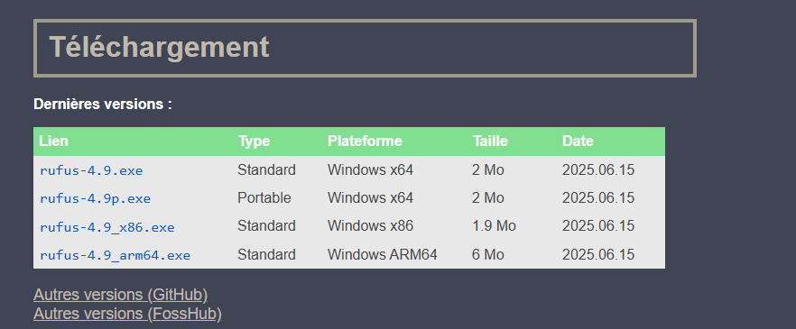
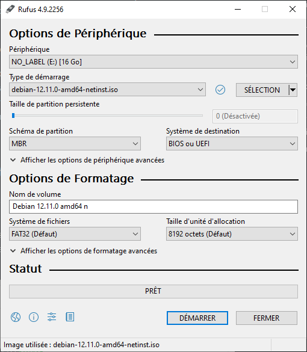
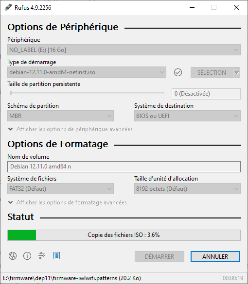
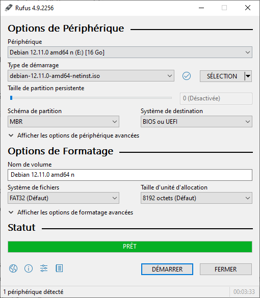
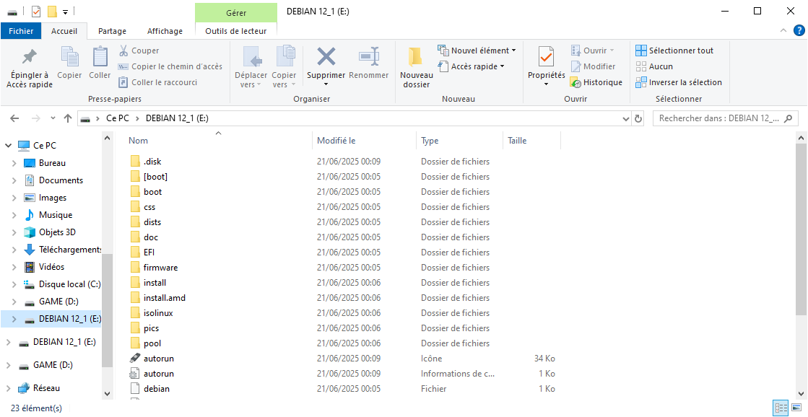

# Étape 1 – Préparation de l'installation de Debian Server

## 🎯 Objectif
Créer une clé USB bootable avec Debian Server, à partir de Windows, pour l’installer plus tard sur le HP T730 Thin Client.

---

## Matériel & outils utilisés

- PC sous Windows 10
- Clé USB de 8 Go minimum (16 go utilisé)
- Logiciel [Rufus](https://rufus.ie)
- ISO Debian : (https://cdimage.debian.org/debian-cd/current/amd64/iso-cd/debian-12.11.0-amd64-netinst.iso)
- Lien officiel Debian : (https://www.debian.org/index.fr.html)

---

## 📝 Étapes réalisées

1. Téléchargement de l’ISO Debian depuis le site officiel.
2. Installation de **Rufus** sur Windows.
3. Insertion de la clé USB.
4. Formater la clé USB 
5. Configuration de Rufus :
   - Périphérique : clé USB détectée
   - Boot selection : ISO Debian téléchargée 
   - Système de fichiers : FAT32
   - Schéma de partition : MBR 
   - Schéma de destination : BIOS ou UEFI
6. Lancement de la création de la clé bootable.
7. ✅ Clé prête à être utilisée pour l'installation.

---

## 📸 Captures d’écran

> ```markdown

## Téléchargement de l’ISO Debian depuis le site officiel.


## Installation de **Rufus** sur Windows.


## Configuration de Rufus :


## Lancement de la création de la clé bootable.


## Clé prête à être utilisée pour l'installation.


## Contenu de la clé bootable.



# ➡️ [Étape suivante →](./Étape 2 – Installation de Debian via la clé bootable et configuration initiale.md)


