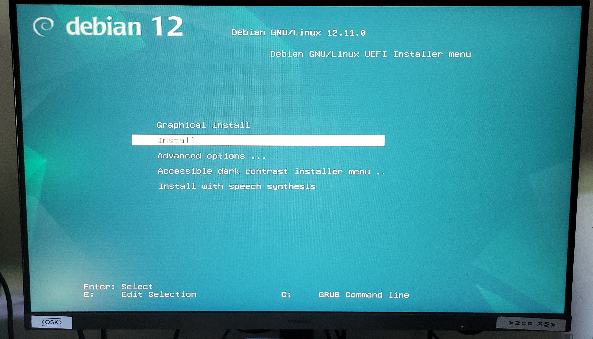

# Étape 2 – Installation de Debian via la clé bootable et configuration initiale

## 🎯 Objectif
Démarrer le HP T730 depuis la clé USB bootable et installer Debian Server avec les bons réglages de base.

---

## 🧰 Prérequis

- ✅ Clé USB bootable créée (voir [Étape 1 – Préparation](./01-preparation.md))
- ⚙️ BIOS prêt à booter sur USB (mode UEFI ou Legacy)
- 🌐 Connexion Internet disponible (Ethernet recommandé)

---

## 🖥️ Démarrage sur la clé USB

Le HP T730 a automatiquement démarré sur la clé USB, **aucun réglage dans le BIOS n’a été nécessaire**.

> ⚠️ *Remarque :* Si ce n’est pas le cas sur une autre machine :
> - Redémarrer l’ordinateur
> - Appuyer sur la touche `SUPPR` (ou `DEL`) dès l’allumage pour accéder au BIOS/UEFI
> - Vérifier ou modifier l’ordre de démarrage pour placer la **clé USB en premier**


## ⚙️ Installation Debian – Étapes principales

### 1. Lancement de l’installation
Au démarrage de la clé USB bootable, un menu s’affiche avec plusieurs options :
- `Graphical install`
- `Install`
- `Advanced options`
- `Accessible dark contrast installer menu`
- `Install with speech synthesis`
  
🖱️ Choix effectué : install 

➡️ Cela lance l’installation **sans interface graphique**, idéale pour un serveur minimaliste.

### 2. 🌐 Configuration réseau

- Connexion automatique via **DHCP** (Ethernet)  
- Nom d’hôte personnalisé : `debian-t730`  
- Nom de domaine : *(laissé vide ici)*  
- Mot de passe **root** : défini  
- Création d’un utilisateur standard : `sidibe`
- Mot de passe **utilisateur standard** : défini  

---

### 3. 💾 Partitionnement du disque

- Disque sélectionné : `sda` (disque principal du HP T730)  
- Méthode : **partitionnement assisté avec LVM** (option recommandée)  
- Formatage automatique → le disque est prêt pour Debian  

---

### 4. 📦 Sélection des paquets

✅ Options choisies pendant l'installation des paquets :  

- ☑️ **Utilitaires usuels du système**  
- ☑️ **Serveur SSH** (permet l'accès à distance)  
- ❌ **Environnement de bureau** : décoché pour garder le système léger  

---

### 5. ⚙️ Installation de GRUB

- Installation du chargeur de démarrage **GRUB** sur le disque principal (`/dev/sda`)  
- Fin de l’installation :  
  - Clé USB retirée  
  - Redémarrage automatique  
  - Système prêt à démarrer sous Debian Server  


---

## ✅ Résultat attendu

- Debian est installé et démarre depuis le disque dur.
- Un terminal (`tty`) s’affiche avec l’invite de connexion :
  
  ```bash
  Debian GNU/Linux 12 debian-t730 tty1

  debian-t730 login:

## 📸 Captures d’écran

> ```markdown

## 1. Lancement de l’installation
> 

> 
